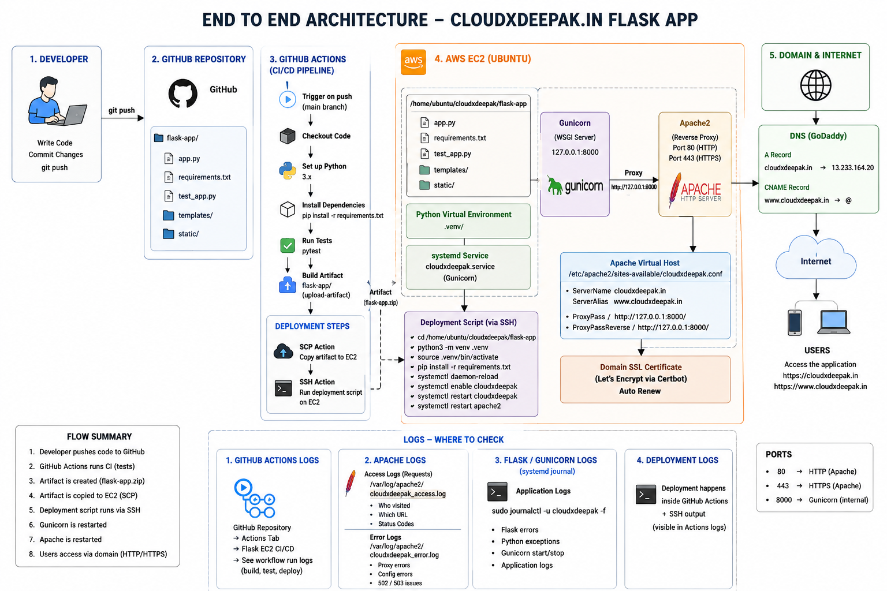

# Flask EC2 Deployment with GitHub Actions

This project demonstrates an end-to-end CI/CD pipeline for deploying a Python Flask application to an AWS EC2 instance using GitHub Actions.

The application is served using Gunicorn behind Apache, while GitHub Actions handles testing, artifact creation, file transfer, and automated deployment.

## Architecture



## Project Flow

```text
Developer
   |
   | git push
   v
GitHub Repository
   |
   v
GitHub Actions
   |
   |-- Checkout Code
   |-- Setup Python
   |-- Install Dependencies
   |-- Run Pytest
   |-- Create Artifact
   |
   v
Deploy Job
   |
   |-- Download Artifact
   |-- Copy Files using SCP
   |-- Connect to EC2 using SSH
   |-- Create Python Virtual Environment
   |-- Install Dependencies
   |-- Restart Gunicorn Service
   |
   v
AWS EC2
   |
   v
Gunicorn
127.0.0.1:8000
   |
   v
Apache Reverse Proxy
Port 80 / 443
   |
   v
cloudxdeepak.in
   |
   v
Users
```

## Technologies Used

- Python
- Flask
- Pytest
- GitHub Actions
- AWS EC2
- Ubuntu
- Apache2
- Gunicorn
- systemd
- SCP
- SSH
- GoDaddy DNS
- Git
- GitHub

## Project Structure

```text
flask-apache-ec2-deployment/
│
├── app.py
├── requirements.txt
├── test_app.py
├── architecture.png
│
├── templates/
│   └── index.html
│
└── static/
    └── style.css
```

The GitHub Actions workflow is stored at the repository root:

```text
.github/
└── workflows/
    └── flask-ec2-deploy.yml
```

## Application

The Flask application provides a basic web page and a health endpoint.

Example health endpoint:

```text
/health
```

Expected response:

```json
{
  "application": "CloudXDeepak DevOps Demo",
  "status": "healthy"
}
```

## Continuous Integration

The CI pipeline starts when code is pushed to the `main` branch and changes are detected inside this project.

The CI job performs the following steps:

1. Checks out the repository.
2. Prepares the required Python runtime.
3. Installs dependencies from `requirements.txt`.
4. Runs automated tests using Pytest.
5. Creates an application artifact after successful testing.

The deployment job runs only if the CI job completes successfully.

```yaml
deploy:
  needs: build
```

This prevents failed code from being deployed.

## Artifact-Based Deployment

Instead of running `git pull` directly on the production server, the pipeline creates an artifact containing the tested application files.

The artifact is downloaded by the deployment job and copied to EC2 using SCP.

This provides a cleaner deployment flow:

```text
Tested Code
   |
Artifact
   |
Deploy
   |
EC2
```

## GitHub Secrets

Sensitive deployment information is stored using GitHub Actions repository secrets.

The workflow uses:

```text
EC2_HOST
EC2_USER
EC2_SSH_KEY
```

These values are referenced in the workflow using GitHub Actions expressions:

```yaml
${{ secrets.EC2_HOST }}
${{ secrets.EC2_USER }}
${{ secrets.EC2_SSH_KEY }}
```

The EC2 private key is never stored directly inside the repository.

## AWS EC2 Configuration

The application runs on an Ubuntu EC2 instance.

Main components installed on the instance:

```text
Python
python3-venv
Apache2
Gunicorn
```

Application deployment directory:

```text
/home/ubuntu/cloudxdeepak/flask-app
```

The application creates its own Python virtual environment:

```text
/home/ubuntu/cloudxdeepak/flask-app/.venv
```

## Gunicorn

Gunicorn is used as the production WSGI server for the Flask application.

It listens only on the local EC2 interface:

```text
127.0.0.1:8000
```

This port is not exposed publicly through the EC2 security group.

Apache communicates with Gunicorn internally.

## systemd Service

Gunicorn is managed using a systemd service:

```text
cloudxdeepak.service
```

The service allows the Flask application to:

- Start automatically.
- Restart after deployment.
- Restart after failures.
- Run independently of the SSH session.

Useful command:

```bash
sudo systemctl status cloudxdeepak
```

Restart the application:

```bash
sudo systemctl restart cloudxdeepak
```

## Apache Reverse Proxy

Apache listens for incoming HTTP and HTTPS requests.

Traffic flow:

```text
Internet
   |
Apache
Port 80 / 443
   |
Reverse Proxy
   |
Gunicorn
127.0.0.1:8000
   |
Flask
```

Apache forwards requests using:

```apache
ProxyPass / http://127.0.0.1:8000/
ProxyPassReverse / http://127.0.0.1:8000/
```

## Domain Configuration

The application is exposed using:

```text
cloudxdeepak.in
```

DNS is managed through GoDaddy.

Root domain:

```text
Type: A
Name: @
Value: EC2 Public IP
```

WWW record:

```text
Type: CNAME
Name: www
Value: @
```

This allows both:

```text
cloudxdeepak.in
www.cloudxdeepak.in
```

to resolve to the application.

## EC2 Security Group

The required inbound ports are:

```text
22    SSH
80    HTTP
443   HTTPS
```

Gunicorn port `8000` is not exposed publicly because Apache communicates with it internally.

## Deployment Process

When a developer pushes a change:

```text
git push
```

GitHub Actions automatically performs:

```text
Push
 |
CI starts
 |
Pytest
 |
Tests pass
 |
Artifact created
 |
Deploy job starts
 |
Artifact copied to EC2
 |
Python environment prepared
 |
Dependencies installed
 |
Gunicorn restarted
 |
Apache continues serving traffic
 |
New application version is live
```

## Logs and Troubleshooting

GitHub Actions deployment logs:

```text
GitHub Repository
-> Actions
-> Flask EC2 CI/CD
```

Flask and Gunicorn logs:

```bash
sudo journalctl -u cloudxdeepak
```

Live application logs:

```bash
sudo journalctl -u cloudxdeepak -f
```

Apache access logs:

```bash
sudo tail -f /var/log/apache2/cloudxdeepak_access.log
```

Apache error logs:

```bash
sudo tail -f /var/log/apache2/cloudxdeepak_error.log
```

## Key Problems Solved

During implementation, the following deployment issues were identified and fixed:

### Artifact Path Mismatch

The application artifact was initially copied into an additional nested directory.

Incorrect:

```text
/home/ubuntu/cloudxdeepak/flask-app/flask-app/
```

Expected:

```text
/home/ubuntu/cloudxdeepak/flask-app/
```

The deployment was corrected using the SCP path configuration.

### Missing systemd Service

The pipeline initially attempted to restart:

```text
cloudxdeepak.service
```

before the service existed.

A dedicated systemd service was created to manage Gunicorn correctly.

### Deployment Failure Detection

The deployment script was updated to use:

```bash
set -e
```

This ensures the deployment stops immediately if any command fails instead of continuing and incorrectly appearing successful.

## What I Learned

This project helped me understand the complete CI/CD lifecycle rather than only writing a YAML workflow.

Key concepts covered:

- GitHub Actions workflows
- Jobs and steps
- GitHub-hosted runners
- Workflow triggers
- Job dependencies using `needs`
- GitHub Secrets
- Artifact-based deployment
- SCP file transfer
- SSH automation
- Python virtual environments
- Flask testing with Pytest
- Gunicorn production deployment
- systemd service management
- Apache reverse proxy
- AWS EC2 networking
- DNS configuration
- Linux troubleshooting
- Application and web server logging

## Result

The final implementation automatically validates and deploys the Flask application whenever approved changes are pushed to the main branch.

```text
Code
-> Test
-> Package
-> Deploy
-> Serve
```

This project demonstrates a complete foundational DevOps CI/CD workflow using GitHub Actions and AWS.